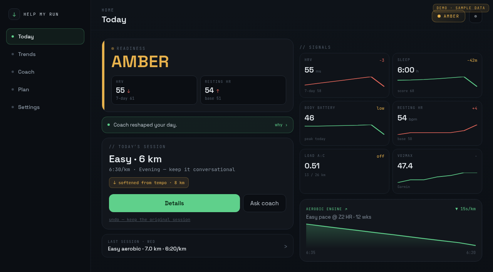
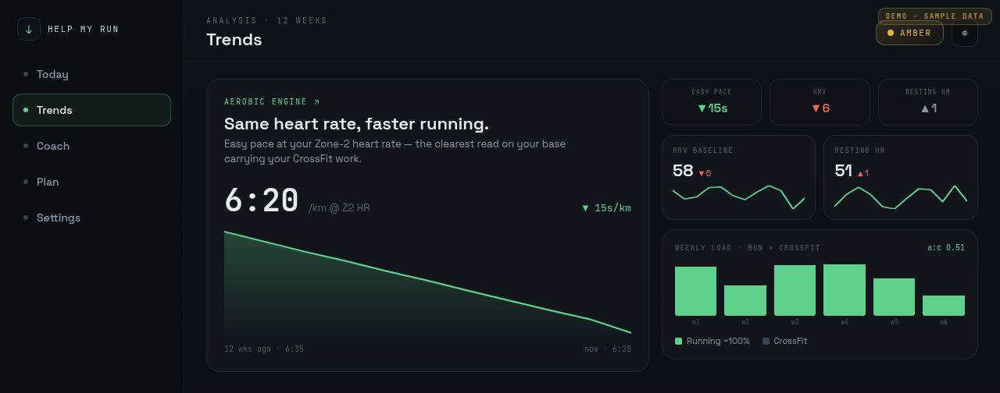
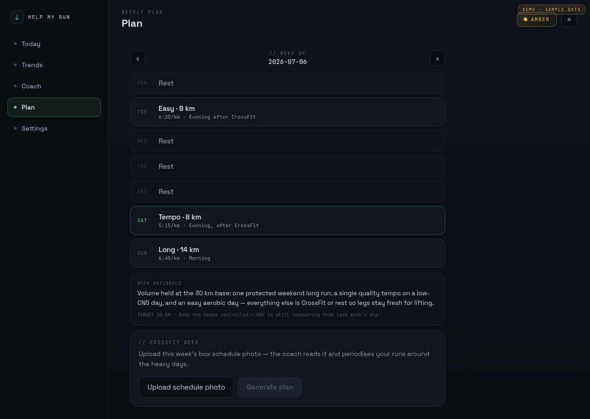
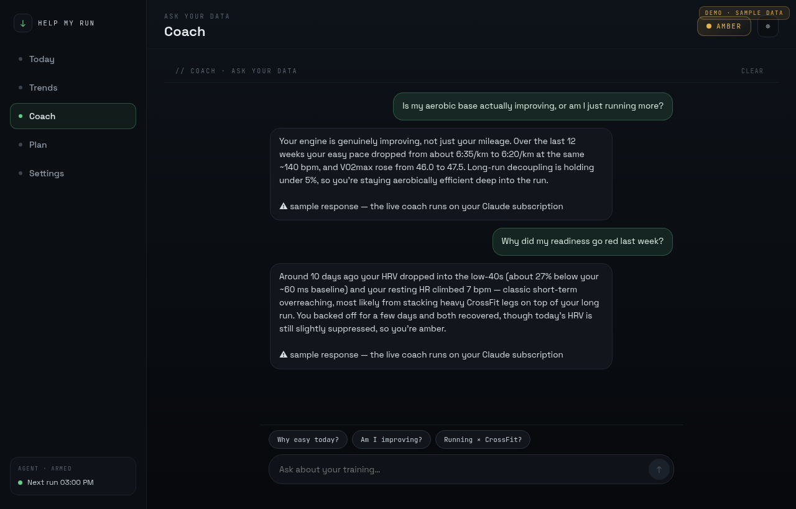
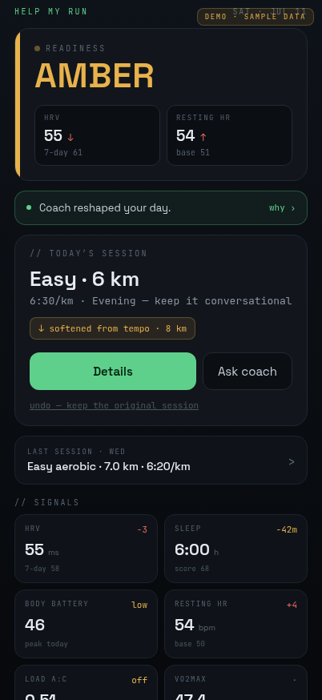
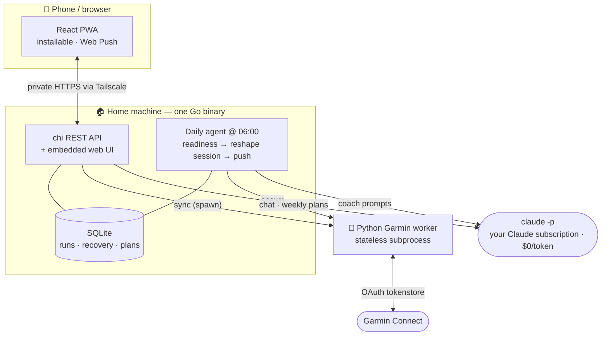

# Help My Run


A self-hostable, single-user AI running coach — now a **website + installable PWA**. It pulls your runs **and** your recovery data (sleep, HRV, Body Battery, resting HR) from **Garmin Connect** into a local database, then uses Claude to coach you: a readiness verdict and a (possibly reshaped) session every morning, 12-week trends, a weekly plan periodised around your CrossFit schedule, and a chat that answers from your own data.

Everything ships as **one binary**: the Go server embeds the built web app. Open it in a browser, install it to your phone's home screen, done.

## Try it in 60 seconds (no accounts needed)

```bash
make demo    # builds the binary, then serves http://localhost:8080 with 12 weeks of synthetic data
```

Demo mode needs **no Garmin account and no Claude subscription** — but `make demo` builds from source, so you do need the toolchains: **Go 1.22+, Node 18+ (to build the UI), and Python 3.11+**. It seeds an in-memory database with a realistic 84-day training block (including an overreach week the coach reacts to) and answers coach requests with labeled sample responses. Nothing touches disk; quit and it's gone. Actions that need real credentials (sync, Garmin login, notifications) are disabled with a "demo mode" message. The real thing — your data, your coach — starts at Prerequisites below.

## Screenshots

_Captured live from `make demo` — every number below is synthetic._



| Trends | Weekly plan |
| :---: | :---: |
| [](docs/assets/trends.png) | [](docs/assets/plan.png) |



<p align="center">
  
  <br><em>Installable on your phone — morning briefings arrive via Web Push.</em>
</p>

## Architecture

- **Go core** (`backend/`) owns the SQLite database, the REST API, the daily agent + sync scheduler, auth, Web Push — and serves the embedded web UI. Single source of truth, single process.
- **Python Garmin worker** (`garmin-worker/`) is a thin, stateless subprocess the Go core invokes to talk to Garmin (fetch, FIT streams, and the web-driven login with MFA over stdin/stdout).
- **Web app** (`web/`) is a React + Vite SPA (dark, monospace-accented design) built into the binary. Installable as a PWA; morning briefings arrive via Web Push.



The single arrow that never exists: **no path from this system to a metered AI bill or a third-party server.** Garmin talk stays in the worker under your account; every Claude call is `claude -p` under your subscription; the SPA and API share one origin, so there's no CORS and nothing to expose.

## Prerequisites

- **A Garmin Connect account** — you'll sign in inside the app on first run (MFA supported). Credentials are used once to mint OAuth tokens and never stored.
- **A Claude subscription + Claude Code CLI.** All AI features run through `claude -p` at **$0 per token** under your subscription. ⚠️ **Leave `ANTHROPIC_API_KEY` UNSET** — any value there (even a placeholder) switches `claude -p` to metered API billing and fails with a 401.
- Go 1.22+, Python 3.11+, and Node.js 18+ (Node is needed only to build the UI).

## Setup

```bash
git clone <your-fork-url> help-my-run
cd help-my-run

# 1. Paths config (no secrets; relative paths resolve against the repo root)
cp .env.example .env

# 2. Worker deps
cd garmin-worker && python -m venv .venv && . .venv/bin/activate && pip install -r requirements.txt && deactivate && cd ..

# 3. Claude Code (subscription path)
claude auth login        # once, on this host — NOT --console
# Headless/VPS with no browser? Run `claude setup-token` on any machine with one,
# then paste the token in the app: Settings → Claude → "Headless server?"

# 4. Build the single binary (builds the web UI + embeds it)
make build
```

## First run

```bash
./bin/helpmyrun          # or: make run-backend (dev mode, runs from source)
```

Open `http://localhost:8080` (or `http://<your-LAN-ip>:8080` from your phone). The first-run wizard walks you through everything:

1. **Secure** — set the owner password (this also mints an API token for scripts, shown once).
2. **Connect Garmin** — sign in with your Garmin email/password; enter the MFA code if asked. Tokens are stored locally; the nightly pull runs unattended from then on.
3. **Goals, numbers, week rhythm, guardrails** — shape how the coach makes calls (e.g. "keep running ≤55% of load so legs stay fresh for lifting").

Then it's live: **Today** (readiness verdict + session), **Trends** (aerobic engine over 12 weeks), **Coach** (ask your data), **Plan** (CrossFit-aware week), Settings.

## Install as an app + notifications

- **Android/desktop Chrome:** you'll get an install prompt (or ⋮ → *Install app*).
- **iPhone:** Share → *Add to Home Screen*. (iOS only allows Web Push for installed PWAs, 16.4+.)
- Enable **morning notifications** in the wizard's last step or Settings → Notifications — the daily agent pushes its verdict when it runs (default 06:00, configurable in Settings).

> **Heads up:** install + Web Push need HTTPS (localhost is exempt). The [Tailscale one-liner](#remote-access-tailscale) below gives your phone private HTTPS anywhere; plain `http://<lan-ip>:8080` still works as a normal website on your LAN (no install/push).

## Run it as a service

Keep the coach running unattended — it wakes at 06:00, syncs Garmin, backs up, and pushes your briefing whether or not you're logged in. `make install` sets up a **user-level** systemd service (no root, no Docker):

```bash
make install
```

That builds the binary, copies it to `~/.local/bin/helpmyrun`, installs the unit at `~/.config/systemd/user/helpmyrun.service` (with this repo baked in as `WorkingDirectory`, so relative `.env` paths keep resolving), and reloads systemd. Then enable it — `make install` prints these:

```bash
systemctl --user enable --now helpmyrun   # start it now, and on every boot
loginctl enable-linger $USER              # ...even when you're not logged in
```

Logs go to journald:

```bash
journalctl --user -u helpmyrun -f
```

### Remote access (Tailscale)

Reach the app from your phone anywhere — private HTTPS on your tailnet, nothing exposed to the internet:

```bash
tailscale serve https / http://localhost:8080
```

This is also what enables PWA install + Web Push off your LAN (both need HTTPS; localhost is exempt). Public domain instead? Caddy is a one-liner:

```bash
# Caddyfile:  yourdomain.example { reverse_proxy localhost:8080 }
```

### Backups & restore

The nightly agent writes a backup right after each daily run — same cadence, no extra timers. Snapshots land in `BACKUP_DIR` (default: a `backups/` dir next to `DB_PATH`):

- `helpmyrun-YYYY-MM-DD.db` — a consistent SQLite snapshot (`VACUUM INTO`).
- `tokenstore-YYYY-MM-DD/` — a copy of the Garmin OAuth tokenstore.

The newest `BACKUP_KEEP` (default 14) of each are kept; older ones are pruned. Override either in `.env`:

```bash
# BACKUP_DIR=/mnt/backup/helpmyrun   # default: <dir of DB_PATH>/backups
# BACKUP_KEEP=14
```

To restore a snapshot, stop the service, copy the files back, start again:

```bash
systemctl --user stop helpmyrun
rm -f "$DB_PATH"-wal "$DB_PATH"-shm     # stale WAL would be replayed over the snapshot
cp backups/helpmyrun-2026-07-09.db "$DB_PATH"                 # over your DB_PATH
cp -r backups/tokenstore-2026-07-09/. "$GARMIN_TOKENSTORE"/   # over the tokenstore
systemctl --user start helpmyrun
```

## Development

```bash
make run-backend   # Go API on :8080
make run-web       # Vite dev server with /api proxied to :8080 (hot reload)
make test          # Go + Python + web test suites
```

## Scripts / API access

The API accepts `Authorization: Bearer <token>` with the API token from setup (regenerate in Settings → Security — it's shown once). E.g. `make sync` POSTs `/api/sync` with `API_TOKEN` from your environment.

Locked out? `./bin/helpmyrun --reset-password` clears the owner password so setup runs again.

## Security notes

- No secrets live in `.env` — the owner password (argon2id), API token (hashed), optional Claude setup-token, and VAPID keys live in the local SQLite DB; Garmin OAuth tokens live in `GARMIN_TOKENSTORE`.
- Garmin credentials are passed to the login subprocess over stdin, used once, never logged or persisted.
- Sessions are HttpOnly SameSite cookies with a 30-day sliding expiry.

## Disclaimer

Garmin access uses the unofficial [`python-garminconnect`](https://github.com/cyberjunky/python-garminconnect) library — Garmin provides no public API for this data. Use it only for **personal access to your own account**. It may break at any time if Garmin changes their site, and you are responsible for complying with Garmin's terms of service.
